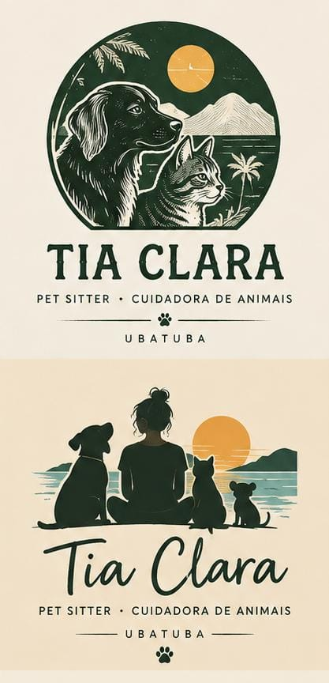

# Tia Clara · Identidade v2: brief

> Resumo operacional do [PRD](../../.claude/prds/tia-clara-nova-identidade.prd.md). Os dados estruturados ficam no bloco `v2` de [`00-brief/brief.json`](../00-brief/brief.json).

## Por que existe uma v2
A Clara rejeitou a logo e as cores da v1 (a plaquinha com "C" sobre verde-pinho quase preto) por três motivos:
- escura demais, "roqueira" e com cara de "Barbie gótica";
- parecida com a logo de uma colega de trabalho;
- a frase de uma peça que ela viu é a da clínica onde ela trabalhou.

A estratégia de marca da v1 continua valendo (segurança, competência e afeto; relatório de visita; protocolos). Mudam a **logo**, a **cor** e a **temperatura**.

## Quem é a Clara (fatos novos)
- 31 anos, mora em Ubatuba e veio de Limeira.
- **Mais de 10 anos com animais como auxiliar de veterinário e chefe de internação.**
- "Se derrete toda com um bichinho": o afeto vai para o animal. Com o tutor, é objetiva.
- Atende **só a região central de Ubatuba**.

## O que precisa ser verdade
| Item | Requisito |
|---|---|
| Cor principal | **Verde-sálvia médio**, mais claro que o pinho da v1 (medido: saturação 12–30 %, luminosidade 50–65 % em HSL) |
| Verde de texto | Legível (AA), sem virar quase preto: luminosidade ≥ 25 % (o pinho da v1 tem ~17 %) |
| Temperatura | Calorosa e ensolarada: litoral de Ubatuba (mar, serra, sol), como na referência de que ela gosta |
| Logo | Versão completa **e** versão reduzida, reconhecível a 32 px (avatar do WhatsApp) e em 1 cor |
| Nome | "Tia Clara". A cursiva é bem-vinda (ela gosta), desde que legível e adulta |
| Descritor | "Pet sitter & dog walker"; na apresentação, "auxiliar de veterinário, pet sitter e dog walker" |
| Credencial | "Experiência em cuidados de enfermagem veterinária (auxiliar de veterinário)", como **experiência**, nunca como serviço clínico |
| Lugar | "Ubatuba" pode aparecer na assinatura |
| Frase de apoio | "Mais qualidade de tempo para quem mais importa." (redação final a confirmar) |

## O que não pode
- Parecer a logo da **colega de trabalho** da Clara (ainda não recebida: a checagem fica pendente).
- Usar **"Cuidar também é um ato de amor"**, frase da Clínica Veterinária Itaguá, onde ela trabalhou, nem lembrar a identidade da clínica.
- **Verde-escuro dominante**, metal, arco que lembre lápide, serifa dramática: o que fez a v1 parecer gótica.
- Códigos de clínica: cruz, azul hospitalar, estetoscópio, jaleco.
- Infantilizar.

## Referência de que ela gosta

Duas logos:
1. Selo com cão e gato ilustrados diante da serra, do mar e do sol.
2. A silhueta dela, de costas, com cão, gato e um terceiro bicho olhando o mar ao pôr do sol, com "Tia Clara" em cursiva e "UBATUBA".

## Entregas do marco 1
Opções para a Clara escolher, sem identidade final:
- 3 paletas;
- 2 ou 3 rotas de logo;
- aplicações mínimas;
- pranchas para o WhatsApp.
